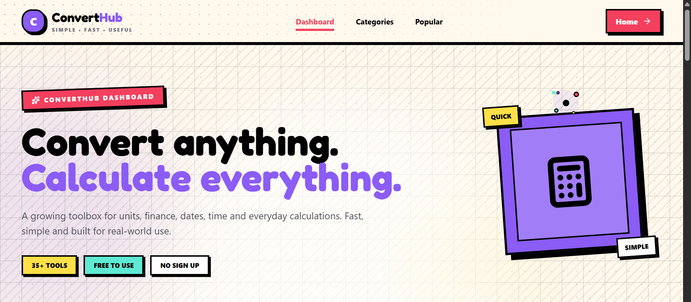
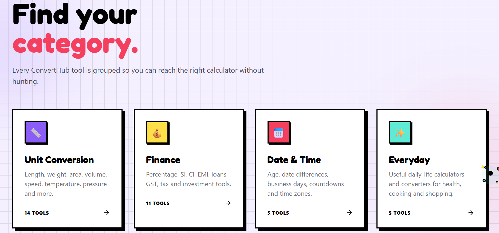
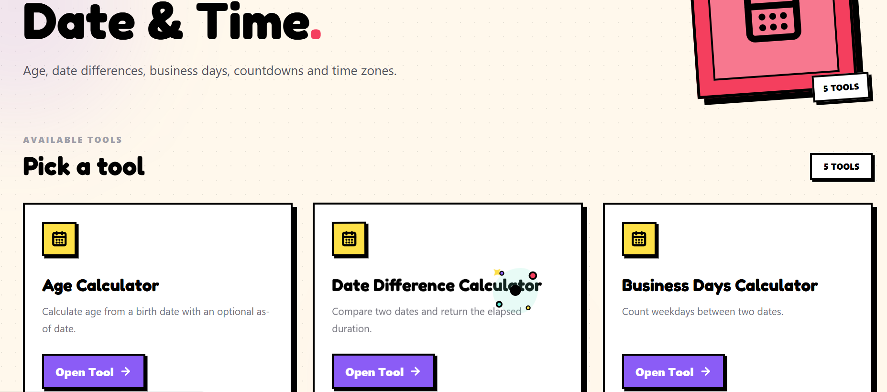

# 🧮 ConvertHub

**ConvertHub** is a modern, responsive web-based toolbox for unit conversions, finance calculations, date & time calculations, and everyday utilities.

The project is designed to make common calculations **fast, simple, and accessible** from any device.

## 🌐 Live Demo

👉 [https://convert-hub-12.vercel.app/](https://convert-hub-12.vercel.app/)

---

## 📸 Screenshots

### 🏠 Hero / Landing Page

The landing page introduces ConvertHub with a bold, playful interface and a clear call-to-action for starting a conversion.


### 📊 Dashboard

The dashboard provides quick access to the main calculator categories and highlights the core ConvertHub toolbox.



### 🗂️ Categories

ConvertHub organizes its tools into clear categories including Unit Conversion, Finance, Date & Time, and Everyday utilities.



### 📅 Date & Time Tools

The Date & Time category provides tools such as the Age Calculator, Date Difference Calculator, and Business Days Calculator.



---

## ✨ Features

### 📏 Unit Converters

Convert between commonly used units such as:

- Length
- Weight
- Area
- Volume
- Speed
- Temperature
- Pressure
- Force
- Torque
- Density
- Energy
- Power
- Frequency
- Fuel Consumption

### 💰 Finance Calculators

- Percentage Calculator
- Simple Interest Calculator
- Compound Interest Calculator
- Profit & Loss Calculator
- Discount Calculator
- GST Calculator
- Tax Calculator
- EMI Calculator
- Loan Calculator
- SIP Calculator
- Currency Converter

### 📅 Date & Time Tools

- Age Calculator
- Date Difference Calculator
- Business Days Calculator
- Countdown Timer
- Timezone Converter

### 🌡️ Everyday Calculators

- BMI Calculator
- Calorie Calculator
- Cooking Converter
- Clothing Size Converter
- Shoe Size Converter

## 🎨 UI & Design

ConvertHub focuses on a simple and user-friendly interface.

### 📱 Fully Responsive

The application is designed to work across:

- 📱 Mobile
- 📲 Tablet
- 💻 Desktop

The layouts automatically adapt to different screen sizes for a consistent experience.

### 🎯 Design Features

- Clean and modern interface
- Bold visual style
- Responsive layouts
- Interactive animations
- Easy-to-use input fields
- Clear calculation results
- Category-based organization
- Searchable toolbox
- Mobile-friendly navigation

## 🛠️ Tech Stack

### Frontend

- ⚛️ React
- 🟨 JavaScript
- 🎨 Tailwind CSS
- 🎬 Framer Motion
- 🧭 React Router
- 🎯 Lucide React

### Backend

- 🟢 Node.js
- 🚂 Express.js
- 🔌 REST APIs
- 🌐 CORS
- ⏱️ Rate Limiting

### External APIs

ConvertHub uses external services for live data such as:

- 💱 Currency exchange rates
- 🌍 Time and timezone information

## 📂 Project Structure

```text
ConvertHub/
│
├── frontend/
│   ├── src/
│   │   ├── components/
│   │   ├── data/
│   │   ├── engines/
│   │   ├── pages/
│   │   ├── App.jsx
│   │   └── main.jsx
│   │
│   ├── public/
│   ├── .env
│   ├── package.json
│   └── vite.config.js
│
├── backend/
│   ├── routes/
│   ├── lib/
│   ├── server.js
│   ├── package.json
│   └── .env
│
├── screenshots/
│   ├── 01-hero.png
│   ├── 02-dashboard.png
│   ├── 03-categories.png
│   └── 04-date-time-tools.png
│
└── README.md
```

## 🚀 Getting Started

### 1. Clone the repository

```bash
git clone YOUR_GITHUB_REPOSITORY_URL
```

```bash
cd ConvertHub
```

### 2. Install frontend dependencies

```bash
cd frontend
npm install
```

### 3. Install backend dependencies

Open another terminal:

```bash
cd backend
npm install
```

## 🔐 Environment Variables

### Frontend

Create a `.env` or `.env.local` file inside the frontend directory:

```env
VITE_API_BASE_URL=http://localhost:3000
```

For production:

```env
VITE_API_BASE_URL=https://convert-hub-sigma.vercel.app
```

### Backend

Create a `.env` file inside the backend directory:

```env
CURRENCY_API_BASE_URL=https://api.frankfurter.dev/v1
TIME_API_BASE_URL=https://time.now/developer/api

ALLOWED_ORIGINS=http://localhost:5173,https://convert-hub-12.vercel.app

RATE_LIMIT_PER_MINUTE=60
```

> ⚠️ Never commit private API keys, passwords, tokens, or sensitive environment variables to GitHub.

## ▶️ Running Locally

### Start the backend

From the `backend` directory:

```bash
npm run dev
```

The backend will run on:

```text
http://localhost:3000
```

Health check:

```text
http://localhost:3000/api/health
```

### Start the frontend

From the `frontend` directory:

```bash
npm run dev
```

The frontend will normally run on:

```text
http://localhost:5173
```

Open the application in your browser:

```text
http://localhost:5173
```

## 🔌 Backend API

The backend currently provides endpoints such as:

### Health

```http
GET /api/health
```

### Currency

```http
GET /api/currency/currencies
```

```http
GET /api/currency/rates?base=USD
```

```http
GET /api/currency/convert?amount=100&from=USD&to=INR
```

### Time

```http
GET /api/time/current?timezone=Asia/Kolkata
```

```http
GET /api/time/timezones
```

```http
GET /api/time/convert?dateTime=2026-08-08T10:00&from=Asia/Kolkata&to=America/New_York
```

## 🚀 Deployment

The project uses **Vercel** for deployment.

### Frontend

Production frontend:

```text
https://convert-hub-12.vercel.app
```

Frontend environment variable:

```env
VITE_API_BASE_URL=https://convert-hub-sigma.vercel.app
```

### Backend

Production backend:

```text
https://convert-hub-sigma.vercel.app
```

Backend CORS configuration:

```env
ALLOWED_ORIGINS=https://convert-hub-12.vercel.app,http://localhost:5173
```

After changing environment variables on Vercel, redeploy the affected project so the new values are applied.

## 🧠 What I Learned

Building ConvertHub helped me gain practical experience with:

- ⚛️ React application architecture
- 🧩 Reusable components
- 🧭 Client-side routing
- 🎨 Responsive UI development
- 🔌 REST API integration
- 🖥️ Node.js backend development
- 🌐 CORS configuration
- 🔐 Environment variables
- ⏱️ API rate limiting
- 🚀 Vercel deployment
- 🔗 Connecting frontend and backend services
- 📱 Responsive design across devices

## 🔮 Future Improvements

Some features planned for future versions:

- ➕ More unit conversions
- 💰 More financial calculators
- 📊 Calculation history
- ⭐ Favorite tools
- 🔍 Improved search
- 🌙 Dark mode
- 📤 Share calculation results
- 📱 Improved mobile experience
- 🌍 More currencies and timezones
- ⚡ Performance improvements

## 🤝 Contributing

Contributions, suggestions, and improvements are welcome.

1. Fork the repository
2. Create a new branch

```bash
git checkout -b feature/new-feature
```

3. Make your changes
4. Commit your changes

```bash
git commit -m "Add new feature"
```

5. Push the branch

```bash
git push origin feature/new-feature
```

6. Open a Pull Request

## 📄 License

This project is open-source and available under the **MIT License**.

## 👨‍💻 Author

Built with ❤️ while learning and exploring modern web development.

⭐ If you find **ConvertHub** useful, consider giving the repository a star!
